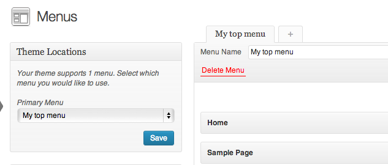

# Wordpress Menufication ##
**Menufication v1.0**

Thank you for purchasing our plugin - Menufication. If you have any questions that are beyond the scope of this readme file, please feel free to email us via our user page contact form [here](http://codecanyon.net/user/iveo). Thanks so much!

## Table of contents
* [Features](#features)
* [Files Included](#files)
* [Setup](#setup)
* * [Installation](#setup-installation)
* * [Settings](#setup-settings)
* [Important Notes](#notes)
* [Browser Support](#support)
* * [Desktop](#support-desktop)
* * [Mobile](#support-mobile)
* [Dependencies](#deps)

## 
Features

* Generates a responsive fly-out menu (similar to Facebook mobile applications).
* Swipe the screen to open/close the menu (iOS only in v1).
* Includes two beautiful themes, one dark and one light.
* Personalize your menu by adding your own logos to it.
* Option to only generate the menu on predefined browser sizes.
* Option to only generate the menu on mobile devices.
* Several options to customize the behaviour of the menu.
* Utilizes CSS-tranforms for optimal performance. Falls back to jQuery animations when CSS-transforms are not supported.
* Uses Wordpress Menu (hooks into `wp_nav_menu`), Wordpress Page Menu ( hooks into `wp_page_menu`) or a custom DOM-element to generate the menu.
* Only dependency is jQuery.

## 
Files Included

##### PHP-files
This plugin	ships with one main `menufication.php` file, menufication.php. Included in the plugin is also a `update-notifier.php` file to check for updates to the plugin. If an update is available, you will be notified when you log in to the admin area.

##### CSS-files
There are two CSS-files included, one for the styling of the actual menu and one for the admin-page. If you wish to make some changes to the styling of the plugin this should **not** be done in the `menufication.min.css`, but instead in the Advanced Settings-section.

##### JavaScript-files
There are three JavaScript-files included in this plugin. One is simply for hiding/showing the advanced settings in the admin-area. The main work is done by `jquery.menufication.min.js` and `menufication-setup.js`. `jquery.menufication.min.js` exposes the jQuery-plugin Menufication which can be used by calling $('#my-menu').menufication().

**Note**: In order to make this plugin load faster in the browser it requires no images whatsoever. It is purely based on CSS/JavaScript.

## 
Setup

### 
Installation

* Unzip the .zip-folder.
* Upload the unzipped folder to your plugin folder in wp-content.
* Activate the plugin on the plugins page in Wordpress Admin.

You can read more about manual installation of pugins [here](http://codex.wordpress.org/Managing_Plugins#Manual_Plugin_Installation).

### 
Customize settings

* To access the settings for Wordpress Menufication, click 'Settings' => 'menufication' in the admin-panel.

##### Choose Menu

There is three ways to define what menu the plugin should use when generating the responsive fly-out menu.

1. Choose a menu from the select-field under the 'Menu' section on the settings-page for the plugin.
2. **Advanced** - Define a custom element (e.g #my-custom-menu) under the Advanced Settings.
3. **Advanced** - Checking the 'Add fallback-support for default wp_page_menu?' under the Advanced Settings will tell the plugin to generate the menu from the default `wp_page_menu`. *This only works if Wordpress is actually using the `wp_page_menu` to generate the navigation and none of the above is used.*

If you are using the first option, the menus you can choose from are the ones you find under Appearance => Menus. The menus are in the box "Theme Locations". It looks like this:

##### Other Settings

All other settings are explained on the settings-page for the plugin.

## 
Important notes

Below are some important notes about this plugin.

**You should only have to worry about this section if you are an advanced user wanting to understand and change the behavior of the plugin.**

##### Structure of the menu

Wordpress Menufication presumes that the menu is generated using UL/LI-structure like the default Wordpress behavior. Though very forgiving about the structure of the HTML, it should should look something like the following (additional divs etc will in most cases be tolerated). As stated above, this is the default structure of WordPress menus. Unless you are using a custom theme or have modified the menus in some way, this should all work out of the box:

	

		<ul>
			<li>
				<a href="#">Page1</a>
			</li>

			<li>
				<a href="#">Page2</a>
				<ul class="sub-menu">
					<li><a href="">SubPage1</a></li>
				</ul>
			</li>

			<li>
				<a href="#">Page3</a>
			</li>
		</ul>
	

##### Allowed tags

Wordpress Menufication only allows certain tags within the menu by default. If tags that are not allowed are found, they and all of their children will automatically be removed. You can extend the list of allowed tags under the Advanced Settings. By default, the following tags are allowed `DIV, NAV, UL, OL, LI, A, P, H1, H2, H3, H4, SPAN`.

##### CSS-selectors for active items

Wordpress Menufication looks for the default Wordpress active menu classes `current-menu-item`,  `current-page-item` and `active` when generating the fly-out menu. If you have used a custom walker or added custom classes for active classes, please specify them under the Advanced Settings.

##### CSS-selectors active menus

Wordpress Menufication looks for the default Wordpress child menu classes `sub-menu` and `children` when generating the fly-out menu with hierarchical support. If you have used a custom walker or added custom classes for child menus, please specify them under the Advanced Settings.

##### Custom CSS

You can easily add custom CSS under the Advanced Settings if there are changes you want to make.

##### Content-wrapping

Wordpress Menufication wraps your entire page in one outer and one inner wrappers. You might encounter problems if your `html`, `body` or `main container element` is positioned absolute or fixed.

##### Custom jQuery events

Wordpress Menufication emits custom jQuery events when the menu has been initialized, reset or reapplied. No additional params are provided.

Listen to these events like so:

	$(document).bind('menufication-done, function(e) {
		console.log('Menufication has been initialized!')
	})

	$(document).bind('menufication-reset, function(e) {
		console.log('Menufication has been reset!')
	})

	$(document).bind('menufication-reapply, function(e) {
		console.log('Menufication has been reapplied from reset state!')
	})

## 
Browser Support

The following browsers are officially supported and tested (Browser > Version):

##### 
Desktop

* Chrome >= 20
* Mozilla Firefox >= 15
* Safari >= 5
* Opera >= 12
* Internet Explorer >= 9

##### 
Mobile

* Chrome for Android / iOS
* Firefox for Android
* AndroidBrowser for Android
* Safari Mobile for iOS

Wordpress Menufication does not currently support Internet Explorer Mobile or Blackberry. Support will be added in upcoming versions.

** Nothing will break on unsupported browsers - the menu will just simply not appear. **

## 
Dependencies

* jQuery >= 1.7.0